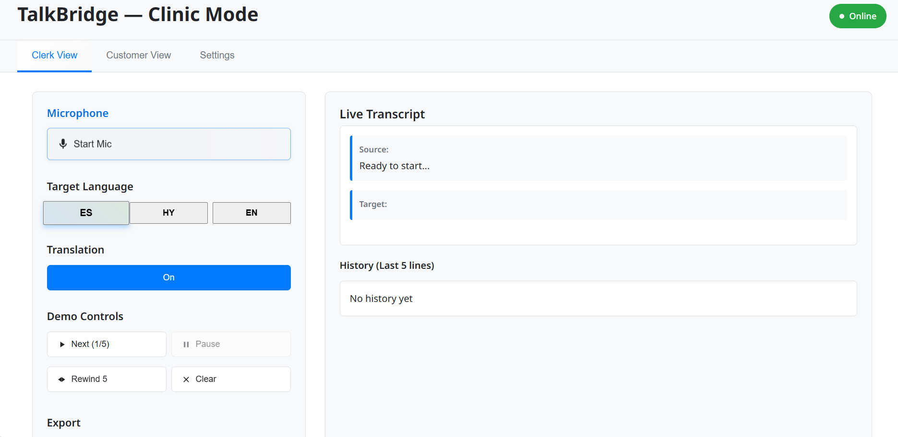
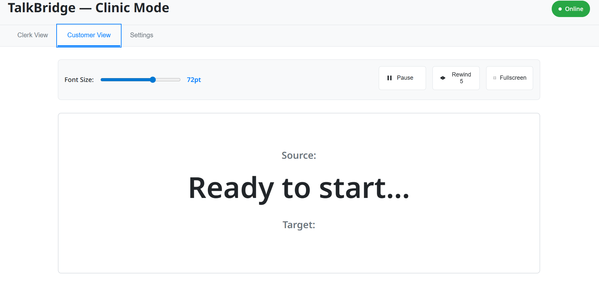

# TalkBridge — Clinic Mode
A kiosk-style web app that shows live captions and one-tap translation (EN ↔ HY ↔ ES) for clinics in Glendale. 🏥

## Why
Glendale has many Armenian/Spanish speakers, and interpreters aren't always available. Phone apps aren't clinic-friendly. TalkBridge makes front-desk conversations fast, clear, and private.

## Features (MVP)
- Big, high-contrast captions (72–96 pt)
- One-tap EN ↔ HY ↔ ES toggle
- Clerk/Customer views + fullscreen kiosk
- Pause / rewind last lines
- Offline demo clip switch (no Wi-Fi needed)
- Privacy banner (no storage by default)

## Demo (quick)
- Open `index.html` in a browser (or Live Server).
- Click **Play Demo** → lines stream every ~1s.
- Toggle language → see target text.
- Try Pause/Resume, Rewind 5, Font slider, Fullscreen. 🗣️

## Keyboard Shortcuts
Space = Start/Stop · 1/2/3 = EN/ES/HY · T = Translate · P = Pause/Resume · R = Rewind · F = Fullscreen · +/− = Font size

## Privacy (important)
**No storage by default.** Export requires consent. The demo uses **no PHI**.

## Screenshots



## Supabase Export (
1) Run `supabase/schema.sql` in your project.
2) In `app.js`, paste your keys:
```js
const SUPABASE_URL = 'https://YOUR-PROJECT-REF.supabase.co';
const SUPABASE_ANON_KEY = 'YOUR-ANON-KEY';
```
Export stays OFF until the user clicks "I consent." ⚙️

## Tech
HTML/CSS/JS. No frameworks. Fonts: Noto Sans / Noto Sans Armenian.

## Roadmap
- Medical quick-phrases set
- Better Armenian transliteration
- ASL input (integrate my ASL Translator project)
- HIPAA review for production

## Made At
Glendale 1-Day Hackathon (2025). Student project.

## License
kokoc30


